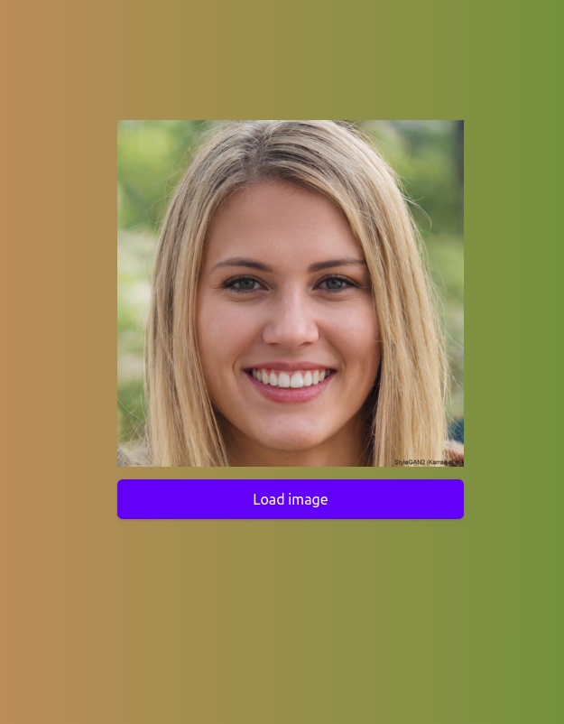

# does-not-exist-demo
Minimalistic app which generates an image of a person who does not exist.  
The sole purpose of this app is to solidify my docker & github actions skills.

<main style='display: flex; flex-direction: row; width: 50%; justify-content: space-between;'>
    

        
        
Placeholder image

    

    

        
        
Generated image

    

</main>
